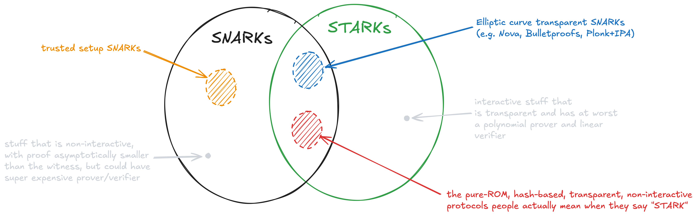

# STARK

> *Overloaded.* The term STARK has been used to mean: 
> 1. the hash-based SNARK of Ben-Sasson *et al.* [[BBHR18]](https://eprint.iacr.org/2018/046),
> 2. any argument of knowledge with a small proof and verifier, a quasi-linear prover and a transparent setup, (could be interactive or non-interactive) or
> 3. any hash-based transparent SNARK.

---

# Origins

"STARK" was first introduced by Ben-Sasson *et al.* [[BBHR18]](https://eprint.iacr.org/2018/046) as an acronym for scalable, transparent argument of knowledge.
The properties are:
- [**Scalable**](./scalable.md): the protocol is [succinct](./succinct.md)[^1] and has a quasi-linear prover.
- [**Transparent**](./transparent_setup.md): the protocol has a transparent setup; that is, one that does not require secret information.
- [**Argument of Knowledge**](./soundness.md#knowledge-soundness): the protocol is an argument and it upholds the knowledge soundness property. At a high level, this means that any computationally bounded prover that produces a valid proof must have *known* the witness.

Notice that "STARK" says nothing about whether the proof should be non-interactive.

The Ben-Sasson *et al.* paper [[BBHR18]](https://eprint.iacr.org/2018/046) also introduce a concrete protocol that met these properties.
By extension, this protocol came to be known as "STARK".

# Evolution

The STARK protocol of Ben-Sasson *et al.* [[BBHR18]](https://eprint.iacr.org/2018/046) was iterated upon and has changed throughout the years.
Techniques such as using quotient polynomials, copy constraints and/or lookup tables have made their way into [stwo](https://github.com/starkware-libs/stwo/tree/dev), the latest iteration of StarkWare's "STARK" proof system.
In this manner, today's "STARK" is essentially a PLONKish protocol with a hash-based polynomial proximity test (e.g., FRI, STIR, WHIR).

# Hash-based SNARKs
Today, people use the term "STARK" to mean "any transparent [SNARK](./snark.md) that relies only on hash functions".
This includes protocols such as Brakedown, Orion and Binius --- which by some definitions are not succinct (!).

# Disambiguation
Summarizing, we have three possible definitions of "STARK":
1. the hash-based SNARK of Ben-Sasson *et al.* [[BBHR18]](https://eprint.iacr.org/2018/046),
2. any argument of knowledge with a small proof and verifier, a quasi-linear prover and a transparent setup, (could be interactive or non-interactive) or
3. any hash-based transparent SNARK.

Most of the time it will be up to you to understand from the context what people mean when they say "STARK".
Although it is very rare that people will use STARK to refer to an interactive proof.

Just for fun I'm including a little Venn diagram of what is and isn't a STARK based on the many definitions.

> **Naming recommendation.** In this book we will use:
> - **"STARK [BBHR18]"** to refer to the transparent SNARK of Ben-Sasson *et al.*, 
> - **"STARK"** to mean "scalable, transparent argument of knowledge"; this could include Nova, [Bulletproofs](https://ieeexplore.ieee.org/abstract/document/8418611) (both transparent SNARKs) and possibly some interactive arguments of knowledge that meet the "scalability" requirement,
> - **"pure ROM SNARKs"**, **"hash-based SNARK"** or **"transparent hash-based SNARK"** to mean SNARKs that use hash functions and no other cryptographic primitive; this includes STARK [BBHR18], Ligero, Binius, PLONK+FRI (Redshift, Plonky2).

[^1]: See the linked article for the variations on that definition.