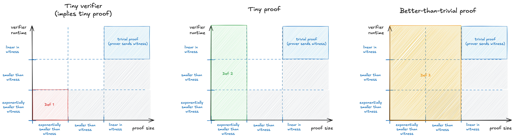

# Succinct

> *Ambiguous.* A proof system is *succinct* if its proof (or verifier) is "smaller" than the size of the private inputs and intermediate computation steps (i.e. the [witness](./witness.md)); how small changes from one definition to the other.

---

We say that a proof system is *succinct* if its proof (or verifier) is "smaller" than the size of the private inputs and intermediate computation steps (i.e. the [witness](./witness.md)). 

However, "small" has been used to mean different things is different contexts.
Here are the main options:
1. **Tiny verifier.** The verifier has to be exponentially faster than running the full computation.
It also implies that the messages it reads (the proof) are also exponentially smaller than the witness.
This definition is the earliest one to appear and also the strictest to satisfy.
It is used in textbooks such as the [*SNARGs Book*](http://snargsbook.org) of Chiesa and Yogev.
2. **Tiny proof.** The proof has to be exponentially smaller than the witness, however we allow the verifier to run in time that is comparable to the full computation.
Examples of systems that satisfy this definition in addition to the ones above are Bulletproofs, Plonk+IPA / Halo2.
3. **Better-than-trivial proof.** The proof has to be asymptotically smaller than the witness.
The verifier is still allowed to run in time that is comparable to the full computation. This definition is the most relaxed. It is promoted in more recent papers and recommended by Justin Thaler in his [17 misconceptions](https://a16zcrypto.com/posts/article/17-misconceptions-about-snarks/#section--3) post.

The image below summarizes these definitions and highlights how they get progressively more relaxed. You can **click on the image to expand it.**

> **Examples.**
> Here are some examples of systems that satisfy the definitions:
> - Groth16, Plonk+KZG, Plonk+FRI, STARK [BBHR18] all **satisfy definitions 1, 2 and 3**.
> - Bulletproofs, Plonk+IPA / Halo2 **satisfy definitions 2 and 3**, but do not satisfy definition 1. Their proofs are exponentially smaller, but their verifiers run in linear-time.
> - Brakedown, Orion, Binius **satisfy definition 3**, but not definitions 1 and 2. Their proof size and verifier runtime scale with the square root of the witness.
