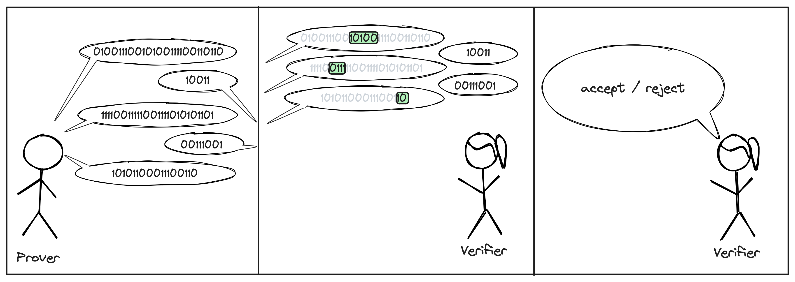

# Introduction to ZK Jargon

---

## Probabilistic and Interactive Proofs

In the [previous article](./what_is_proving.md), we covered what "proving" means, established some necessary vocabulary and finally discusses the trivial proof system: sending the witness.
As discussed, this is not always desirable.
Sometimes the witness is private and should remain so.
Other times, the witness is just too big to be sent or for the verifier to process.

In this article, we look at two techniques to build more elaborate proof systems: 
- the first is to allow the verifier to "ask multiple questions", i.e. to interact with the prover; 
- the second is to allow the verifier to not read the whole proof, as long as they rarely accept a "proof" for an invalid statement.

Both of these technique are a testimony to the **power of randomness**, and the huge benefits we gain from **allowing the verifier a small error probability**.

### 1. Asking multiple questions

### 2. Not reading the full proof

### 3. Combining both

---
*All cartoons created in [Excalidraw](https://plus.excalidraw.com), using the Stick Figures package by [Youri Tjang](https://github.com/youritjang) and the Speech Bubbles package by [Oscar Capraro](https://www.grepper.com/app/profile.php?id=44392).*